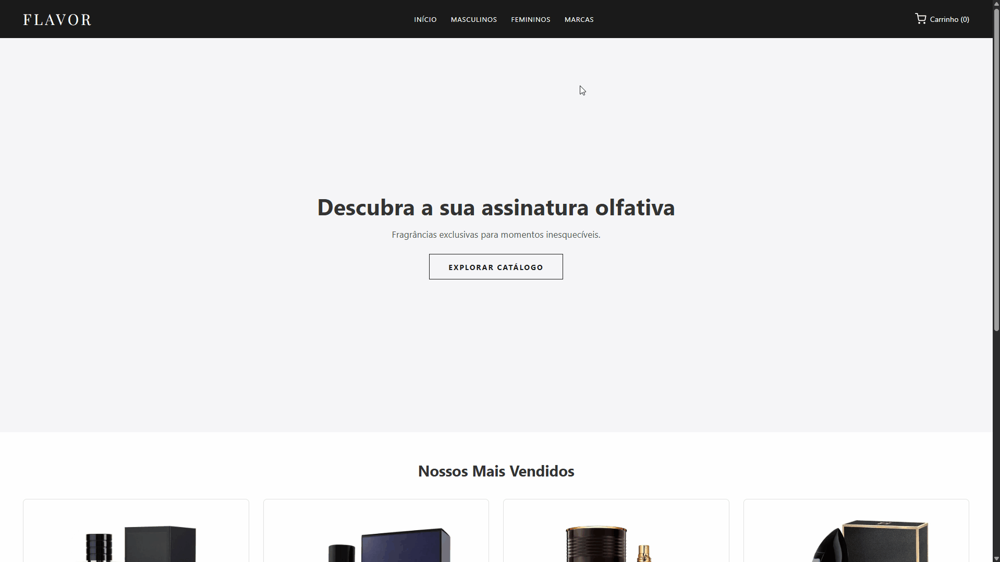

# 🧪 Flavor Perfumaria - E-Commerce Componentizado


🌎 **Acesse o projeto online:** [Clique aqui para testar a Flavor (Em breve no GitHub Pages)](#)

---

## 📷 Demonstração Visual


*Demonstração da filtragem de produtos em tempo real, adição de itens e funcionamento dinâmico do carrinho.*

---

## 🚀 Funcionalidades da Aplicação

- **Vitrine Dinâmica (SPA):** Os cartões dos produtos são gerados de forma automatizada pelo JavaScript a partir de uma base de dados local, eliminando a necessidade de HTML estático repetitivo.
- **Filtro Avançado de Categorias:** Navegação inteligente no menu (Masculinos, Femininos, Início) que filtra os produtos em tempo real através do método `.filter()`, sem recarregamento de página.
- **Detetive de URLs:** Página de detalhes (`produto.html`) que lê os parâmetros da URL, localiza o perfume correspondente com `.find()` e renderiza todas as informações dinamicamente.
- **Carrinho de Compras Persistente:** Sistema de carrinho que armazena as escolhas do usuário no `LocalStorage`. Os itens permanecem guardados mesmo que o navegador seja fechado.
- **Gestão de Sessão Dinâmica:** Sincronização visual imediata do contador do cabeçalho através de módulos utilitários e lógica cirúrgica de remoção de itens com delegação de eventos (`evento.target`).

---

## 📁 Arquitetura e Estrutura de Arquivos

O projeto foi modularizado utilizando os padrões modernos do **ES6 Modules**, separando as responsabilidades de forma limpa e profissional:

* **`database.js`:** Catálogo centralizado de dados (Mock).
* **`carrinhoUtils.js`:** Utilitário global responsável por atualizar a contagem do cabeçalho de forma síncrona.
* **`home.js`:** Controlador da vitrine inicial, responsável por gerenciar a renderização e interceptar cliques do menu para aplicar filtros.
* **`produto.js`:** Responsável por ler a barra de endereços (`URLSearchParams`), capturar o ID do perfume e estruturar a interface de detalhes.
* **`carrinho.js`:** Gerencia a listagem dos itens comprados, cálculo acumulado do valor total e exclusão de itens via delegação de eventos.

---

## 🛠️ Tecnologias Utilizadas

* **HTML5** * **CSS3**
* **JavaScript (ES6+)**
* **Local Storage API**

---

## 🏁 Como Executar o Projeto Localmente

1. Clone este repositório para a sua máquina local:
   ```bash
   git clone https://github.com/seu-usuario/nome-do-seu-repositorio.git

---

## 📞 Contato & Redes Sociais

Desenvolvido por **Yago Hideo Torigoe** — Sinta-se à vontade para entrar em contato!

[](https://www.linkedin.com/in/yago-hideo-torigoe-529b543b3/)
[](mailto:yagohideotorigoe@gmail.com)